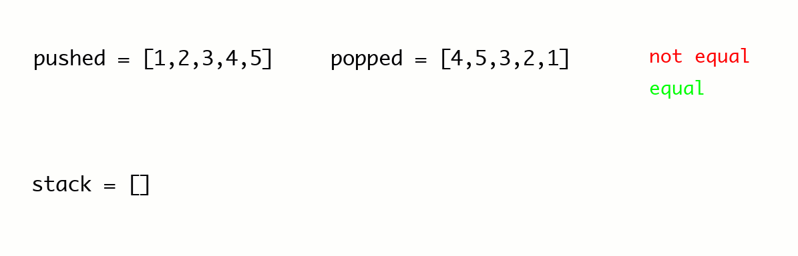

<h2><a href="https://leetcode.com/problems/validate-stack-sequences">983. Validate Stack Sequences</a></h2><h3>Medium</h3><hr><p>Given two integer arrays <code>pushed</code> and <code>popped</code> each with distinct values, return <code>true</code><em> if this could have been the result of a sequence of push and pop operations on an initially empty stack, or </em><code>false</code><em> otherwise.</em></p>

<p>&nbsp;</p>
<p><strong class="example">Example 1:</strong></p>

<pre>
<strong>Input:</strong> pushed = [1,2,3,4,5], popped = [4,5,3,2,1]
<strong>Output:</strong> true
<strong>Explanation:</strong> We might do the following sequence:
push(1), push(2), push(3), push(4),
pop() -&gt; 4,
push(5),
pop() -&gt; 5, pop() -&gt; 3, pop() -&gt; 2, pop() -&gt; 1
</pre>

<p><strong class="example">Example 2:</strong></p>

<pre>
<strong>Input:</strong> pushed = [1,2,3,4,5], popped = [4,3,5,1,2]
<strong>Output:</strong> false
<strong>Explanation:</strong> 1 cannot be popped before 2.
</pre>

<p>&nbsp;</p>
<p><strong>Constraints:</strong></p>

<ul>
	<li><code>1 &lt;= pushed.length &lt;= 1000</code></li>
	<li><code>0 &lt;= pushed[i] &lt;= 1000</code></li>
	<li>All the elements of <code>pushed</code> are <strong>unique</strong>.</li>
	<li><code>popped.length == pushed.length</code></li>
	<li><code>popped</code> is a permutation of <code>pushed</code>.</li>
</ul>

# Solution 

```python
class Solution:
    def validateStackSequences(self, pushed: List[int], popped: List[int]) -> bool:
        stack = []
        pop_index = 0

        for num in pushed:
            stack.append(num)
            
            while stack and pop_index < len(popped) and stack[-1] == popped[pop_index]:
                stack.pop()
                pop_index += 1
        
        return not stack
```

"""
PROBLEM: Given push and pop sequences, determine if they represent valid stack operations

KEY INSIGHTS:
1. Simulate the actual stack operations
2. Push elements from 'pushed' array
3. Pop elements when they match 'popped' sequence
4. Valid if stack is empty at the end

ALGORITHM:
1. Use a stack to simulate operations
2. For each element in pushed:
   - Push it onto stack
   - While stack top matches current popped element:
     - Pop from stack
     - Move to next element in popped sequence
3. Return true if stack is empty (all elements processed)

WHY THIS WORKS:
- We can only pop elements in stack order (LIFO)
- If at any point we can't match the popped sequence, it's invalid
- A valid sequence will leave the stack empty
"""

"""
TRACE EXAMPLE: pushed=[1,2,3,4,5], popped=[4,5,3,2,1]

num=1: stack=[1], no pops possible
num=2: stack=[1,2], no pops possible  
num=3: stack=[1,2,3], no pops possible
num=4: stack=[1,2,3,4], pop 4 (matches popped[0])
       stack=[1,2,3], pop_index=1
num=5: stack=[1,2,3,5], pop 5 (matches popped[1])
       stack=[1,2,3], pop_index=2
       pop 3 (matches popped[2]), stack=[1,2], pop_index=3
       pop 2 (matches popped[3]), stack=[1], pop_index=4
       pop 1 (matches popped[4]), stack=[], pop_index=5

Final: stack=[] → return True

INVALID EXAMPLE: pushed=[1,2,3], popped=[3,1,2]

num=1: stack=[1]
num=2: stack=[1,2]  
num=3: stack=[1,2,3], pop 3 → stack=[1,2], pop_index=1
       Can't pop 1 (it's not on top)
Final: stack=[1,2] → return False
"""
